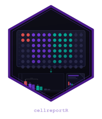

# cellreportR 

<!-- badges: start -->
[](https://github.com/r-heller/cellreportR/actions/workflows/R-CMD-check.yaml)
[](https://app.codecov.io/gh/r-heller/cellreportR)
[](https://github.com/r-heller/cellreportR/actions/workflows/pkgdown.yaml)
[](https://opensource.org/licenses/MIT)
<!-- badges: end -->

**cellreportR** is a complete analysis and reporting pipeline for
routine cell-culture laboratory diagnostics with microscopic
evaluation. It picks up where segmentation leaves off: segmented
single-cell data flows in, and structured statistical analyses,
quality-controlled results, and publication- and audit-ready reports
flow out.

## Pipeline

```
Cell culture -> Treatment -> Staining -> Microscopy -> Segmentation
                                                    (segmantR / CellProfiler / QuPath)
                                                             |
                                                             v
                                                +---------------------+
                                                |     cellreportR     |
                                                |                     |
                                                |  Design & QC        |
                                                |  Normalization      |
                                                |  Hierarchical tests |
                                                |  Effect sizes + ROC |
                                                |  Dose-response      |
                                                |  Visualization      |
                                                |  Report generation  |
                                                |  Shiny dashboard    |
                                                +---------------------+
                                                             |
                                                             v
                                                Structured diagnostic report
```

## Installation

```r
# install.packages("pak")
pak::pak("r-heller/cellreportR")
```

## Quick example

```r
library(cellreportR)

exp <- cr_example_experiment(seed = 42)
exp <- cr_qc_filter(exp, min_area = 50, max_area = 5000)

res <- cr_test_all(exp,
                   channel = "marker_1",
                   control_group = "Untreated",
                   level = "replicate")

cr_plot_effect_sizes(res)
```

## Interactive analysis

```r
cr_run_app()
```

The Shiny app provides a guided seven-tab workflow covering data
import, QC, normalization, statistical analysis, dose-response
fitting, interactive visualisation and report generation.

## Documentation

- [Getting Started](https://r-heller.github.io/cellreportR/articles/getting-started.html)
- [Statistical Analysis](https://r-heller.github.io/cellreportR/articles/statistical-analysis.html)
- [Dose-Response](https://r-heller.github.io/cellreportR/articles/dose-response.html)
- [Shiny App Guide](https://r-heller.github.io/cellreportR/articles/shiny-app.html)

## Citation

If you use cellreportR in your research, please cite the package:

```r
citation("cellreportR")
```
