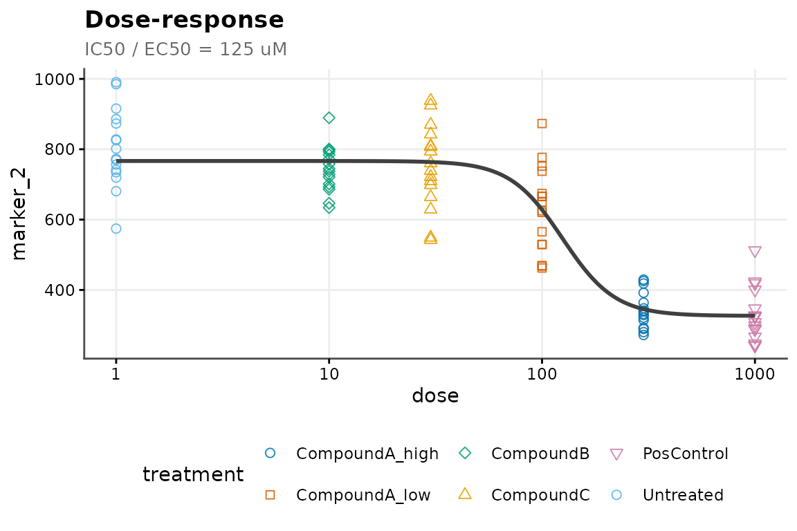

# Dose-Response Analysis

[](https://github.com/CTTIR/cellreportR/actions/workflows/R-CMD-check.yaml)
[](https://cttir.github.io/cellreportR/)
[](https://CRAN.R-project.org/package=cellreportR)
[](https://app.codecov.io/gh/CTTIR/cellreportR?branch=main)
[](https://cran.r-project.org/package=cellreportR)
[](https://cran.r-project.org/package=cellreportR)
[](https://opensource.org/licenses/MIT)
[](https://lifecycle.r-lib.org/articles/stages.html#experimental)

cellreportR fits three standard dose-response models:

- **4PL** (four-parameter log-logistic)
- **3PL** (fixed lower asymptote at zero)
- **Linear** (for convenience; fits `y ~ x`)

## Setting up a dose-response experiment

Any `cr_experiment` with a `dose` column in `design` is eligible.

``` r

exp <- cr_example_experiment(seed = 3, n_cells_per_well = 60)
exp$design$dose <- dplyr::case_when(
  exp$design$treatment == "Untreated"      ~ 0.1,
  exp$design$treatment == "CompoundA_low"  ~ 50,
  exp$design$treatment == "CompoundA_high" ~ 500,
  exp$design$treatment == "PosControl"     ~ 1000,
  TRUE ~ 10
)
```

## Fitting

``` r

fit <- cr_dose_response(exp,
                        channel = "marker_1",
                        model = "4pl",
                        log_dose = TRUE)
fit$model
#> [1] "4pl"
fit$params
#> # A tibble: 4 × 3
#>   parameter estimate std_error
#>   <chr>        <dbl>     <dbl>
#> 1 a           615.          NA
#> 2 d          4503.          NA
#> 3 e             8.90        NA
#> 4 b         -3072.          NA
```

## IC50 / EC50

``` r

cr_ic50(fit)
#> # A tibble: 1 × 5
#>   parameter   estimate ci_low ci_high units
#>   <chr>          <dbl>  <dbl>   <dbl> <chr>
#> 1 IC50      788211529.     NA      NA uM
```

## Plotting

``` r

cr_plot_dose_response(fit)
```



## Troubleshooting

If [`nls()`](https://rdrr.io/r/stats/nls.html) fails to converge (for
example when there are very few dose levels), cellreportR falls back to
a linear model. Check `fit$model` after fitting.
