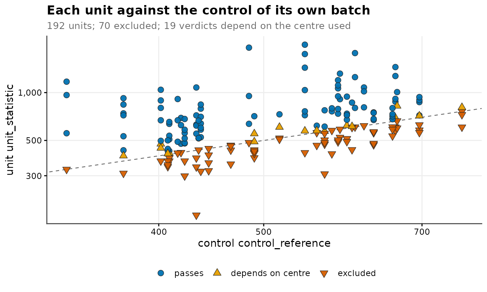
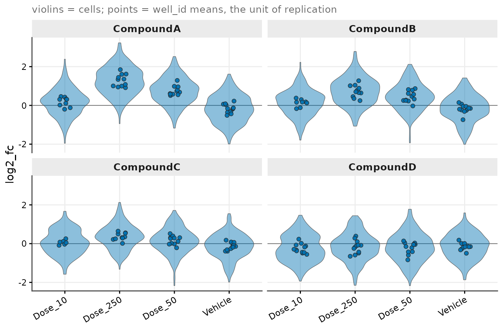
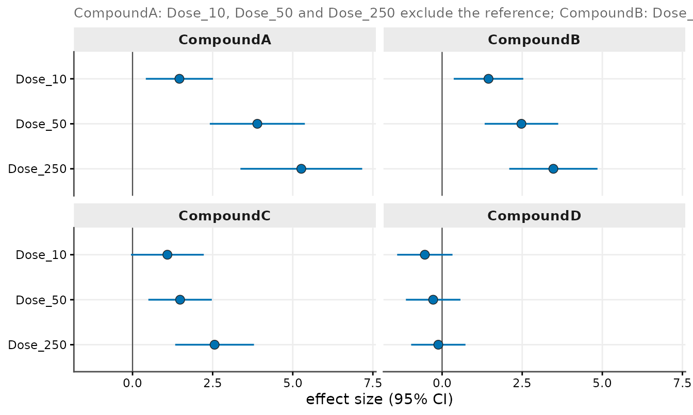
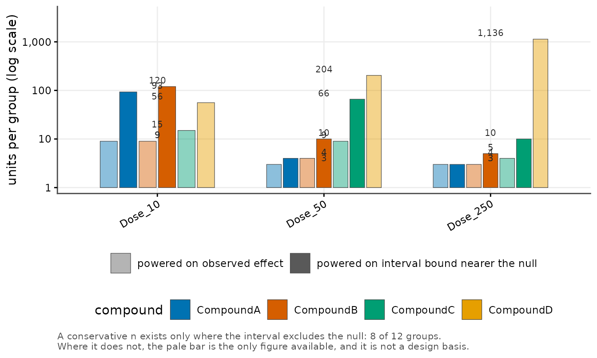

# End to End: From Segmented Exports to a Finished Report

[`vignette("getting-started")`](https://cttir.github.io/cellreportR/articles/getting-started.md)
runs the short path on a single plate. This vignette runs the long one,
in the order the package is meant to be used:

    files on disk -> units -> quality control -> standardization
        -> effect sizes at two levels -> sample size -> report

Every stage is a separate exported function. Nothing here is a wrapper
that hides a decision, because each of these stages *is* a decision, and
the package’s job is to make it visible and auditable afterwards.

All data below is synthetic and generated in-session under an explicit
seed.

## 1. Ingest: the design lives in the tree and the file name

Segmentation software writes one export per acquisition, and the design
facts that matter — which compound, which experiment, which plate, which
pre-treatment interval, which exposure level — are usually encoded in
the directory layout and the file name rather than inside the file.
[`cr_example_exports()`](https://cttir.github.io/cellreportR/reference/cr_example_exports.md)
writes such a tree so the ingest functions can be demonstrated on real
files.

``` r

root <- file.path(tempdir(), "cr_vignette_exports")
files <- cr_example_exports(root, seed = 42, n_cells = 60)
basename(files)
#>  [1] "CompoundA_15min_vehicle_1.csv"                   
#>  [2] "CompoundA_15min_250uM_treated_1.csv"             
#>  [3] "CompoundA_15min_250uM_treated_1.1 (split).csv"   
#>  [4] "CompoundA_60min_vehicle_2.csv"                   
#>  [5] "CompoundA_60min_250uM_treated_2.csv"             
#>  [6] "CompoundA_60min_250uM_treated_2 (repeat).csv"    
#>  [7] "CompoundA_60min_250uM_treated_2.2.csv"           
#>  [8] "CompoundB_15min_vehicle_1.csv"                   
#>  [9] "CompoundB_15min_250uM_treated_1.csv"             
#> [10] "CompoundB_15min_250uM_treated_1 (no reagent).csv"
```

Three things in those names are not decoration:

- `(split)` marks the second pass of a **two-pass acquisition**. Left
  unmerged, that unit contributes twice the cells of its neighbours.
- `(repeat)` marks a **repeated read** of a unit that already has a
  plain sibling file.
- `_2.2` *looks* like a second pass of unit `2`, but is a **different
  physical unit** on a different plate. It must not merge.
- `(no reagent)` marks the **specificity arm**, where the detection
  reagent was left out. Those acquisitions are never samples.

### Column names, path levels, file-name grammar

Three small declarations describe the tree. Each is an object you can
print and check before a single file is read.

``` r

map <- cr_column_map(
  exact = c("Event Label"          = "cell_id",
            "Position X [px]"      = "x",
            "Position Y [px]"      = "y",
            "Nuclei - Signal Mean" = "nuclear_signal",
            "Target - Signal Mean" = "target_signal"),
  prefix = c("^Nuclei - Area" = "area")
)

grammar <- cr_filename_grammar(
  tokens = list(interval = "[0-9]+min",
                dose     = "[0-9]+uM",
                mode     = "treated|vehicle"),
  defaults = list(dose = "0uM", mode = "vehicle"),
  core_patterns = c("^[0-9]+min_vehicle$", "^[0-9]+min_[0-9]+uM_treated$"),
  prefix_strip = c("CompoundA", "CompoundB")
)

markers <- cr_marker_rules(
  merge_unit      = "\\(split\\)",
  partial_plate   = "\\(partial\\)",
  omitted_reagent = "\\(no reagent\\)",
  reacquisition   = "\\(repeat\\)"
)

spec <- cr_path_spec(
  levels  = c("run", "compound", "experiment", "plate"),
  grammar = grammar,
  markers = markers
)
spec
#> <cr_path_spec>
#> • levels: run / compound / experiment / plate
#> • grammar tokens: interval, dose, mode
#> • markers: set
#> • strict: TRUE
```

`core_patterns` is the part worth pausing on. The *absence* of a token
is meaningful here: a name with no exposure token is a vehicle control.
A typo in a token therefore matches nothing, falls through to the
default, and silently reclassifies a treated acquisition as a control —
pulling it into the control denominator of its own batch. The whitelist
turns that silent misclassification into a hard error.

``` r

cells <- cr_read_exports(root, column_map = map, spec = spec, progress = FALSE)
dim(cells)
#> [1] 600  25
all(cells$parse_ok)
#> [1] TRUE
```

Each file now carries the design facts recovered from its path and its
name. The tokens:

``` r

per_file <- unique(cells[, c("source_file", "compound", "plate", "interval",
                             "dose", "mode", "replicate", "merge_unit",
                             "reacquisition", "omitted_reagent")])
per_file$source_file <- sub("\\.csv$", "", per_file$source_file)
per_file[, c("source_file", "interval", "dose", "mode", "replicate")]
#> # A tibble: 10 × 5
#>    source_file                                  interval dose  mode    replicate
#>    <chr>                                        <chr>    <chr> <chr>   <chr>    
#>  1 CompoundA_15min_250uM_treated_1.1 (split)    15min    250uM treated 1.1      
#>  2 CompoundA_15min_250uM_treated_1              15min    250uM treated 1        
#>  3 CompoundA_15min_vehicle_1                    15min    0uM   vehicle 1        
#>  4 CompoundA_60min_250uM_treated_2 (repeat)     60min    250uM treated 2        
#>  5 CompoundA_60min_250uM_treated_2.2            60min    250uM treated 2.2      
#>  6 CompoundA_60min_250uM_treated_2              60min    250uM treated 2        
#>  7 CompoundA_60min_vehicle_2                    60min    0uM   vehicle 2        
#>  8 CompoundB_15min_250uM_treated_1 (no reagent) 15min    250uM treated 1        
#>  9 CompoundB_15min_250uM_treated_1              15min    250uM treated 1        
#> 10 CompoundB_15min_vehicle_1                    15min    0uM   vehicle 1
```

and the markers, each one a typed flag rather than a string somebody has
to remember:

``` r

per_file[, c("source_file", "merge_unit", "reacquisition", "omitted_reagent")]
#> # A tibble: 10 × 4
#>    source_file                              merge_unit reacquisition omitted_reagent
#>    <chr>                                    <lgl>      <lgl>         <lgl>          
#>  1 CompoundA_15min_250uM_treated_1.1 (spli… TRUE       FALSE         FALSE          
#>  2 CompoundA_15min_250uM_treated_1          FALSE      FALSE         FALSE          
#>  3 CompoundA_15min_vehicle_1                FALSE      FALSE         FALSE          
#>  4 CompoundA_60min_250uM_treated_2 (repeat) FALSE      TRUE          FALSE          
#>  5 CompoundA_60min_250uM_treated_2.2        FALSE      FALSE         FALSE          
#>  6 CompoundA_60min_250uM_treated_2          FALSE      FALSE         FALSE          
#>  7 CompoundA_60min_vehicle_2                FALSE      FALSE         FALSE          
#>  8 CompoundB_15min_250uM_treated_1 (no rea… FALSE      FALSE         TRUE           
#>  9 CompoundB_15min_250uM_treated_1          FALSE      FALSE         FALSE          
#> 10 CompoundB_15min_vehicle_1                FALSE      FALSE         FALSE
```

### Files are not units

The specificity arm is split off first, so it cannot be merged into a
sample unit by accident. What remains is resolved into analysis units.

``` r

aside   <- cells[cells$omitted_reagent, , drop = FALSE]
samples <- cells[!cells$omitted_reagent, , drop = FALSE]

samples <- cr_assign_units(
  samples,
  key_vars = c("compound", "experiment", "plate", "interval", "dose", "mode"),
  rules    = cr_merge_rules()
)
attr(samples, "n_units")
#> [1] 7
```

[`cr_unit_map()`](https://cttir.github.io/cellreportR/reference/cr_unit_map.md)
is the receipt: which unit came from how many files.

``` r

umap <- cr_unit_map(samples)
umap$file <- sub("\\.csv$", "", basename(umap$source_path))
umap[, c("file", "n_cells", "n_files", "merged")]
#> # A tibble: 9 × 4
#>   file                                      n_cells n_files merged
#>   <chr>                                       <int>   <int> <lgl> 
#> 1 CompoundA_15min_vehicle_1                      60       1 FALSE 
#> 2 CompoundA_15min_250uM_treated_1.1 (split)      60       2 TRUE  
#> 3 CompoundA_15min_250uM_treated_1                60       2 TRUE  
#> 4 CompoundA_60min_vehicle_2                      60       1 FALSE 
#> 5 CompoundA_60min_250uM_treated_2 (repeat)       60       2 TRUE  
#> 6 CompoundA_60min_250uM_treated_2                60       2 TRUE  
#> 7 CompoundA_60min_250uM_treated_2.2              60       1 FALSE 
#> 8 CompoundB_15min_vehicle_1                      60       1 FALSE 
#> 9 CompoundB_15min_250uM_treated_1                60       1 FALSE
length(unique(umap$well_id))
#> [1] 7
```

Nine sample files became seven units. The `(split)` and `(repeat)` files
merged into their siblings; `_2.2` stayed a unit of its own.

``` r

ds_files <- cr_dataset(samples, unit_var = "well_id")
ds_files
#> 
#> ── cr_dataset
#> • cells: 540 x 27
#> • source files: 9
#> • unit column: well_id
#> • units: 7
#> • design: not set
```

## 2. Scaling up

That tree has one unit per arm, which is enough to demonstrate ingest
and not enough to estimate anything. The rest of this vignette uses
[`cr_example_screen()`](https://cttir.github.io/cellreportR/reference/cr_example_screen.md),
which produces the same object shape — units carrying file provenance, a
vehicle control inside every batch, a set-aside specificity arm — at a
size that supports estimation.

``` r

screen <- cr_example_screen(seed = 1, n_compounds = 4, n_cells_per_well = 25)
screen
#> ── cr_experiment ───────────────────────────────────────────────────────────────────
#> • Cells: 4707 across 192 well_ids
#> • Channels: "nuclear_signal" and "target_signal"
#> • Design: 4 treatment groups
#> • QC steps applied: 0
#> ℹ Metadata fields: project, design, and control_level
batch <- screen$batch_vars
batch
#> [1] "compound"   "experiment" "plate"      "interval"
```

A batch here is the *combination* of four columns, not one column.
Everything downstream that references a control references the control
of the unit’s own batch.

``` r

table(screen$design$compound, screen$design$treatment)
#>            
#>             Dose_10 Dose_250 Dose_50 Vehicle
#>   CompoundA      12       12      12      12
#>   CompoundB      12       12      12      12
#>   CompoundC      12       12      12      12
#>   CompoundD      12       12      12      12
```

## 3. Quality control at the cell level

Sub-threshold debris first, then balancing — in that order, because
excluding first changes the pool that balancing samples from.

``` r

ds <- cr_exclude_small(screen, var = "area", probs = 0.10)
ds <- cr_balance_cells(ds, n_max = 30, seed = 1)
cr_qc_summary(ds)[, c("step", "cells_before", "cells_after", "percent_removed")]
#> # A tibble: 2 × 4
#>   step             cells_before cells_after percent_removed
#>   <chr>                   <int>       <int>           <dbl>
#> 1 cr_exclude_small         4707        4236          10.0  
#> 2 cr_balance_cells         4236        4216           0.472
```

The QC log is append-only and travels with the object, so the
disposition of every cell is recoverable at the end from the object
itself rather than from a lab notebook.

## 4. Standardization against each unit’s own control

The second experiment ran at a higher raw baseline than the first, and
the second plate higher than the first. Both offsets act on control and
treated units alike, which is exactly what standardizing against the
control of a unit’s own batch removes.

``` r

ref <- cr_batch_reference(ds, channel = "target_signal",
                          control_level = "Vehicle", batch_vars = batch)
head(ref[, c("batch_key", "n_cells", "ctrl_n", "ctrl_median", "has_control")], 4)
#> # A tibble: 4 × 5
#>   batch_key                           n_cells ctrl_n ctrl_median has_control
#>   <chr>                                 <int>  <int>       <dbl> <lgl>      
#> 1 CompoundA | Exp_1 | Plate_1 | 15min     195     50        402. TRUE       
#> 2 CompoundA | Exp_1 | Plate_2 | 15min      89     30        329. TRUE       
#> 3 CompoundA | Exp_1 | Plate_1 | 60min     179     45        433. TRUE       
#> 4 CompoundA | Exp_1 | Plate_2 | 60min     101     21        588. TRUE
```

Inspect this table before standardizing, not after: a batch with very
few control cells, or none at all, is visible here while it is still
cheap to notice.

``` r

ds <- cr_standardize_batch(ds,
                           channel       = "target_signal",
                           control_level = "Vehicle",
                           batch_vars    = batch,
                           method        = "log2_fc",
                           value_to      = "log2_fc")
round(summary(ds$cells$log2_fc), 3)
#>    Min. 1st Qu.  Median    Mean 3rd Qu.    Max. 
#>  -2.198  -0.406   0.135   0.146   0.654   3.228
```

`log2_fc` is now a per-cell value on a common scale: zero is the control
of that cell’s own batch.

## 5. The unit-level gate, and what it costs

A control-referenced gate is a biological rather than a statistical
criterion: a treated unit should carry more target signal than the
vehicle control acquired in its own batch.

``` r

gate <- cr_qc_gate(ds,
                   channel       = "target_signal",
                   control_level = "Vehicle",
                   batch_vars    = batch)
gate
#> 
#> ── QC gate ─────────────────────────────────────────────────────────────────────────
#> Signal target_signal vs "Vehicle" of the same batch
#> Rule: unit median must be greater than the control median
#> • 192 units, 144 gated
#> • 38 fail vs the control median
#> • 54 fail vs the control mean
#> • 38 excluded under the chosen rule
#> ! 16 verdicts depend on which control centre is used.
```

The gate can only ever drop *low* units. A gate that is too strict
therefore manufactures apparent treatment effects rather than removing
artefacts, so the leverage of the exclusions has to be quantified
**before** they are applied, while both states are still in hand.

``` r

impact <- cr_qc_gate_impact(ds, gate,
                            value           = "log2_fc",
                            group_var       = "treatment",
                            reference_level = "Vehicle",
                            by              = "compound")
# a narrow view of the same table: every contrast is against "Vehicle",
# so that part of the label carries no information here
data.frame(
  compound     = impact$compound,
  contrast     = sub("^Vehicle -> ", "", impact$contrast),
  n_excluded   = impact$n_units_excluded,
  d_with       = round(impact$estimate_with_excluded, 2),
  d_without    = round(impact$estimate_without_excluded, 2),
  sign_changed = impact$sign_changed
)
#>     compound contrast n_excluded d_with d_without sign_changed
#> 1  CompoundA  Dose_10          3   0.84      1.46        FALSE
#> 2  CompoundA Dose_250          1   2.10      5.27        FALSE
#> 3  CompoundA  Dose_50          0   3.89      3.89        FALSE
#> 4  CompoundB  Dose_10          4   0.70      1.45        FALSE
#> 5  CompoundB Dose_250          0   3.47      3.47        FALSE
#> 6  CompoundB  Dose_50          0   2.48      2.48        FALSE
#> 7  CompoundC  Dose_10          6   0.12      1.09        FALSE
#> 8  CompoundC Dose_250          2   1.77      2.56        FALSE
#> 9  CompoundC  Dose_50          1   1.33      1.48        FALSE
#> 10 CompoundD  Dose_10          9  -0.54      1.16         TRUE
#> 11 CompoundD Dose_250          6  -0.12      0.71         TRUE
#> 12 CompoundD  Dose_50          6  -0.28      1.04         TRUE
```

`d_with` is the effect estimated with the failing units retained,
`d_without` the same estimate once they are dropped. Read the last
column. For the three responsive compounds the gate removes a few units
and moves the estimate in the direction it already pointed. For the
weakest compound the gate removes most of the treated units and *flips
the sign*: there, the gate is doing the selecting, not the compound.

That is a reviewed decision, not an automatic one, and
[`cr_apply_gate()`](https://cttir.github.io/cellreportR/reference/cr_apply_gate.md)
accepts a reviewed exclusion list rather than insisting on the gate’s
own.

``` r

flips    <- unique(impact$compound[impact$sign_changed])
qc_units <- cr_qc_report(ds, gate)
reviewed <- qc_units$well_id[qc_units$verdict == "fail" &
                               !qc_units$compound %in% flips]
c(gate_excluded = length(gate$excluded), reviewed = length(reviewed))
#> gate_excluded      reviewed 
#>            38            17

ds <- cr_apply_gate(ds, gate, units = reviewed)
cr_qc_summary(ds)[, c("step", "cells_before", "cells_after", "percent_removed")]
#> # A tibble: 4 × 4
#>   step              cells_before cells_after percent_removed
#>   <chr>                    <int>       <int>           <dbl>
#> 1 cr_exclude_small          4707        4236          10.0  
#> 2 cr_balance_cells          4236        4216           0.472
#> 3 standardize_batch         4216        4216           0    
#> 4 cr_apply_gate             4216        3852           8.63
```

``` r

cr_plot_qc_gate(gate,
                statistic = "unit_statistic",
                reference = "control_reference",
                title = "Each unit against the control of its own batch")
```



## 6. Effect sizes at both levels

The same grid is computed twice from the same cells: once aggregated to
the unit of replication, once on the cells as they are.

``` r

eff_unit <- cr_effect_grid(ds,
                           value           = "log2_fc",
                           group_var       = "treatment",
                           reference_level = "Vehicle",
                           by              = "compound",
                           unit            = "well_id",
                           min_n           = 3)

eff_cell <- cr_effect_grid(ds,
                           value           = "log2_fc",
                           group_var       = "treatment",
                           reference_level = "Vehicle",
                           by              = "compound",
                           min_n           = 10)

# shorten the labels of both grids together: cr_compare_levels() joins
# them on the columns they share, so they have to stay consistent
eff_unit$contrast <- sub("^Vehicle -> ", "", eff_unit$contrast)
eff_cell$contrast <- sub("^Vehicle -> ", "", eff_cell$contrast)

eff_unit[, c("compound", "contrast", "n_cmp", "cohens_d",
             "cohens_d_ci_low", "cohens_d_ci_high", "p_BH")]
#> # A tibble: 12 × 7
#>    compound  contrast n_cmp cohens_d cohens_d_ci_low cohens_d_ci_high          p_BH
#>    <chr>     <chr>    <int>    <dbl>           <dbl>            <dbl>         <dbl>
#>  1 CompoundA Dose_10      9    1.46           0.415             2.51  0.00665      
#>  2 CompoundA Dose_50     12    3.89           2.41              5.38  0.0000000172 
#>  3 CompoundA Dose_250    11    5.27           3.37              7.17  0.00000000380
#>  4 CompoundB Dose_10      8    1.45           0.364             2.53  0.00665      
#>  5 CompoundB Dose_50     12    2.48           1.33              3.62  0.0000155    
#>  6 CompoundB Dose_250    12    3.47           2.10              4.85  0.000000151  
#>  7 CompoundC Dose_10      6    1.09          -0.0478            2.22  0.0301       
#>  8 CompoundC Dose_50     11    1.48           0.494             2.47  0.00414      
#>  9 CompoundC Dose_250    10    2.56           1.33              3.79  0.0000210    
#> 10 CompoundD Dose_10     12   -0.538         -1.40              0.325 0.242        
#> 11 CompoundD Dose_50     12   -0.278         -1.13              0.573 0.550        
#> 12 CompoundD Dose_250    12   -0.118         -0.965             0.730 0.777
```

[`cr_compare_levels()`](https://cttir.github.io/cellreportR/reference/cr_compare_levels.md)
puts the two side by side and divides the interval widths.

``` r

cmp <- cr_compare_levels(eff_unit, eff_cell)
head(cmp, 4)
#> # A tibble: 4 × 7
#>   compound  contrast estimate_unit estimate_cell width_unit width_cell ratio
#>   <chr>     <chr>            <dbl>         <dbl>      <dbl>      <dbl> <dbl>
#> 1 CompoundA Dose_10           1.46         0.483       2.10      0.377  5.56
#> 2 CompoundA Dose_50           3.89         1.31        2.97      0.367  8.07
#> 3 CompoundA Dose_250          5.27         2.03        3.80      0.426  8.93
#> 4 CompoundB Dose_10           1.45         0.429       2.17      0.381  5.70
round(attr(cmp, "median_ratio"), 1)
#> [1] 5.6
```

The unit-level interval is several times wider than the cell-level
interval for the same estimate. That ratio is not precision gained by
measuring more cells; it is pseudo-replication. Cells within a unit are
not independent, so the cell-level interval understates the uncertainty
of the very same number. Interpretation belongs to the unit level.

Plates are crossed with arms in this design, so the contrast can also be
taken within plate:

``` r

units <- cr_summarize_wells(ds, channel = "log2_fc", fun = stats::median)
blocked <- cr_blocked_effect(units,
                             value           = "value",
                             group_var       = "treatment",
                             reference_level = "Vehicle",
                             block_var       = "plate",
                             by              = "compound")
head(blocked[, c("compound", "contrast", "n_blocks", "shift_within_block",
                 "ci_low", "ci_high", "d_within_block")], 4)
#> # A tibble: 4 × 7
#>   compound  contrast       n_blocks shift_within_block ci_low ci_high d_within_block
#>   <chr>     <chr>             <int>              <dbl>  <dbl>   <dbl>          <dbl>
#> 1 CompoundA Vehicle -> Do…        2              0.353  0.109   0.597           1.34
#> 2 CompoundA Vehicle -> Do…        2              0.902  0.669   1.14            3.28
#> 3 CompoundA Vehicle -> Do…        2              1.41   1.13    1.69            4.41
#> 4 CompoundB Vehicle -> Do…        2              0.355  0.164   0.546           1.79
```

``` r

cr_plot_screen(ds,
               value     = "log2_fc",
               group_var = "treatment",
               units     = "well_id",
               facet_by  = "compound",
               seed      = 1)
```



``` r

cr_plot_forest(eff_unit,
               estimate = "cohens_d",
               ci_low   = "cohens_d_ci_low",
               ci_high  = "cohens_d_ci_high",
               label    = "contrast",
               facet_by = "compound")
```



## 7. Sample size for the follow-up study

A follow-up powered on the observed point estimate is powered on the
luckiest reading of the current data.
[`cr_power_grid()`](https://cttir.github.io/cellreportR/reference/cr_power_grid.md)
solves the sample size from the confidence bound *nearer the null*
instead, and says so in the `basis` column.

``` r

sizes <- cr_power_grid(eff_unit)
sizes[, c("compound", "contrast", "cohens_d", "d_conservative",
          "n_observed", "n_conservative")]
#> # A tibble: 12 × 6
#>    compound  contrast cohens_d d_conservative n_observed n_conservative
#>    <chr>     <chr>       <dbl>          <dbl>      <dbl>          <dbl>
#>  1 CompoundA Dose_10     1.46           0.415          9             93
#>  2 CompoundA Dose_50     3.89           2.41           3              4
#>  3 CompoundA Dose_250    5.27           3.37           3              3
#>  4 CompoundB Dose_10     1.45           0.364          9            120
#>  5 CompoundB Dose_50     2.48           1.33           4             10
#>  6 CompoundB Dose_250    3.47           2.10           3              5
#>  7 CompoundC Dose_10     1.09          NA             15             NA
#>  8 CompoundC Dose_50     1.48           0.494          9             66
#>  9 CompoundC Dose_250    2.56           1.33           4             10
#> 10 CompoundD Dose_10    -0.538         NA             56             NA
#> 11 CompoundD Dose_50    -0.278         NA            204             NA
#> 12 CompoundD Dose_250   -0.118         NA           1136             NA
```

A contrast whose interval spans the null is not sizable at all, and is
reported as such rather than given a number. The `basis` column says
which of the two happened for every row:

``` r

table(sizes$basis)
#> 
#>     confidence bound nearer the null interval spans the null; not sizable 
#>                                    8                                    4
```

``` r

cr_plot_sample_size(sizes, label = "contrast", colour_by = "compound")
```



## 8. The report

[`cr_report()`](https://cttir.github.io/cellreportR/reference/cr_report.md)
collects the experiment, the quality-control record, the effect grid,
the sample sizes, any supplementary tables and any figures into one
object. Assembling first and formatting later is what keeps a number in
the text tied to the object it came from.

``` r

report <- cr_report(
  ds,
  qc      = gate,
  effects = eff_unit,
  sizes   = sizes,
  tables  = list(units = units, gate_impact = impact, batch_reference = ref),
  plots   = list(
    forest = cr_plot_forest(eff_unit,
                            estimate = "cohens_d",
                            ci_low   = "cohens_d_ci_low",
                            ci_high  = "cohens_d_ci_high",
                            label    = "contrast",
                            facet_by = "compound")
  ),
  title  = "Four-compound screen",
  author = "cellreportR example"
)
names(cr_tables(report))
#>  [1] "summary"         "effects"         "sizes"           "qc"             
#>  [5] "units"           "gate_impact"     "batch_reference" "disposition"    
#>  [9] "design"          "channels"
```

Its `summary` slot is one row per contrast, with the effect grid and the
sample sizes already joined — the overview table of the write-up,
derived rather than retyped:

``` r

report$summary[, c("compound", "contrast", "cohens_d", "cohens_d_ci_low",
                   "cohens_d_ci_high", "n_conservative")]
#> # A tibble: 12 × 6
#>    compound  contrast cohens_d cohens_d_ci_low cohens_d_ci_high n_conservative
#>    <chr>     <chr>       <dbl>           <dbl>            <dbl>          <dbl>
#>  1 CompoundA Dose_10     1.46           0.415             2.51              93
#>  2 CompoundA Dose_50     3.89           2.41              5.38               4
#>  3 CompoundA Dose_250    5.27           3.37              7.17               3
#>  4 CompoundB Dose_10     1.45           0.364             2.53             120
#>  5 CompoundB Dose_50     2.48           1.33              3.62              10
#>  6 CompoundB Dose_250    3.47           2.10              4.85               5
#>  7 CompoundC Dose_10     1.09          -0.0478            2.22              NA
#>  8 CompoundC Dose_50     1.48           0.494             2.47              66
#>  9 CompoundC Dose_250    2.56           1.33              3.79              10
#> 10 CompoundD Dose_10    -0.538         -1.40              0.325             NA
#> 11 CompoundD Dose_50    -0.278         -1.13              0.573             NA
#> 12 CompoundD Dose_250   -0.118         -0.965             0.730             NA
```

Tables go out as machine-readable files:

``` r

out <- file.path(tempdir(), "cr_vignette_out")
dir.create(out, showWarnings = FALSE)
written <- cr_export_tables(cr_tables(report), out, format = "csv",
                            one_file = FALSE)
basename(written)
#>  [1] "summary.csv"         "effects.csv"         "sizes.csv"          
#>  [4] "qc.csv"              "units.csv"           "gate_impact.csv"    
#>  [7] "batch_reference.csv" "disposition.csv"     "design.csv"         
#> [10] "channels.csv"
```

And every number quoted in prose is emitted from the objects themselves,
rather than transcribed:

``` r

macro_file <- file.path(out, "generated-numbers.tex")
cr_macros(
  list(
    n_units        = nrow(units),
    n_cells        = cr_n_cells(ds),
    top_effect     = max(eff_unit$cohens_d),
    n_conservative = as.integer(max(sizes$n_conservative, na.rm = TRUE))
  ),
  macro_file
)
cat(readLines(macro_file), sep = "\n")
#> % Generated by cellreportR -- do not edit by hand.
#> % Every value is derived from the analysis object. If one looks
#> % wrong, fix the analysis and emit this file again.
#> 
#> \newcommand{\nunits}{175}
#> \newcommand{\ncells}{3,852}
#> \newcommand{\topeffect}{5.267}
#> \newcommand{\nconservative}{120}
```

Rendering the assembled object to a document is one further call. It is
shown but not executed here, because it needs a working pandoc and
writes a file:

``` r

cr_render_report(report, output_dir = out, format = "html")
# The same assembled report can also be exported as PDF or Word:
cr_render_report(report, output_dir = out, format = "pdf")
cr_render_report(report, output_dir = out, format = "docx")
```

## What was decided, and where it is recorded

| Decision | Made by | Recorded in |
|----|----|----|
| Which files are one unit | [`cr_assign_units()`](https://cttir.github.io/cellreportR/reference/cr_assign_units.md) | [`cr_unit_map()`](https://cttir.github.io/cellreportR/reference/cr_unit_map.md), `provenance` |
| Which objects are debris | [`cr_exclude_small()`](https://cttir.github.io/cellreportR/reference/cr_exclude_small.md) | `qc_log` |
| How many cells per unit | [`cr_balance_cells()`](https://cttir.github.io/cellreportR/reference/cr_balance_cells.md) | `qc_log` |
| What a batch is | `batch_vars` | [`cr_batch_reference()`](https://cttir.github.io/cellreportR/reference/cr_batch_reference.md) |
| Which units are excluded | reviewed list | `qc_log`, `metadata$qc_gate` |
| What the exclusions cost | [`cr_qc_gate_impact()`](https://cttir.github.io/cellreportR/reference/cr_qc_gate_impact.md) | report table |
| Which level is interpreted | unit | [`cr_compare_levels()`](https://cttir.github.io/cellreportR/reference/cr_compare_levels.md) |
| What powers the next study | conservative bound | `basis` column |

## Next steps

- [`vignette("getting-started")`](https://cttir.github.io/cellreportR/articles/getting-started.md)
  — the short path on a single plate.
- [`vignette("statistical-analysis")`](https://cttir.github.io/cellreportR/articles/statistical-analysis.md)
  — cell versus unit inference in detail.
- [`vignette("dose-response")`](https://cttir.github.io/cellreportR/articles/dose-response.md)
  — fitting exposure-response curves.
- [`vignette("shiny-app")`](https://cttir.github.io/cellreportR/articles/shiny-app.md)
  — the same pipeline in a browser.
