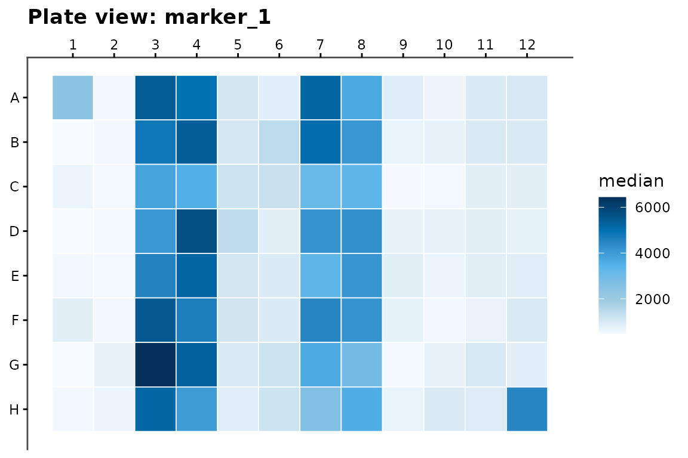

# Getting Started with cellreportR

cellreportR takes segmented single-cell microscopy data to a structured,
auditable set of estimates. This vignette walks the short path on one
plate using bundled synthetic data;
[`vignette("end-to-end")`](https://cttir.github.io/cellreportR/articles/end-to-end.md)
walks the long one, from files on disk to a finished report.

### 1. Load example data

[`cr_example_experiment()`](https://cttir.github.io/cellreportR/reference/cr_example_experiment.md)
simulates a 96-unit plate: six treatment levels, four channels, two
plates and two pre-treatment intervals. Sub-threshold debris, a
plate-edge effect and a pair of saturated units are built in, so the
quality-control functions have something real to remove.

``` r

exp <- cr_example_experiment(seed = 42, n_cells_per_well = 60)
exp
#> ── cr_experiment ───────────────────────────────────────────────────────────────────
#> • Cells: 5757 across 96 wells
#> • Channels: "DAPI", "marker_1", "marker_2", and "marker_3"
#> • Design: 6 treatment groups
#> • QC steps applied: 0
#> ℹ Metadata fields: project and sop
```

### 2. Inspect the design

``` r

head(exp$design)
#> # A tibble: 6 × 9
#>   well  treatment  dose dose_unit group   replicate plate   interval timepoint
#>   <chr> <chr>     <dbl> <chr>     <chr>       <int> <chr>   <chr>        <dbl>
#> 1 A01   Untreated     0 uM        control         1 Plate_1 15min           24
#> 2 B01   Untreated     0 uM        control         1 Plate_1 15min           24
#> 3 C01   Untreated     0 uM        control         1 Plate_2 15min           24
#> 4 D01   Untreated     0 uM        control         1 Plate_2 15min           24
#> 5 E01   Untreated     0 uM        control         2 Plate_1 15min           24
#> 6 F01   Untreated     0 uM        control         2 Plate_1 15min           24
```

The unit of replication is the well, not the cell.
[`cr_n_cells()`](https://cttir.github.io/cellreportR/reference/cr_n_cells.md)
counts by any design column:

``` r

cr_n_cells(exp, by = "treatment")
#> # A tibble: 6 × 2
#>   treatment      n_cells
#>   <chr>            <int>
#> 1 CompoundA_high     962
#> 2 CompoundA_low      984
#> 3 CompoundB          946
#> 4 CompoundC          970
#> 5 PosControl         924
#> 6 Untreated          971
```

A batch here is the combination of two columns, which is what later
standardization references:

``` r

exp$batch_vars
#> [1] "plate"    "interval"
table(exp$design$plate, exp$design$interval)
#>          
#>           15min 60min
#>   Plate_1    24    24
#>   Plate_2    24    24
```

### 3. Apply quality control

``` r

exp_qc <- exp |>
  cr_qc_filter(min_area = 50, max_area = 5000, min_circularity = 0.2) |>
  cr_qc_doublets(k = 2.5)

cr_qc_summary(exp_qc)[, c("step", "cells_before", "cells_after",
                          "percent_removed")]
#> # A tibble: 2 × 4
#>   step           cells_before cells_after percent_removed
#>   <chr>                 <int>       <int>           <dbl>
#> 1 cr_qc_filter           5757        5442          5.47  
#> 2 cr_qc_doublets         5442        5440          0.0368
```

The QC log is append-only and travels with the object, so what was
removed stays recoverable after the fact.

### 4. Fold changes and tests

[`cr_test_all()`](https://cttir.github.io/cellreportR/reference/cr_test_all.md)
contrasts every treatment level against the control and attaches a
summary table with the multiplicity adjustments alongside — never
instead of — the unadjusted p-value.

``` r

res <- cr_test_all(exp_qc,
                   channel       = "marker_1",
                   control_group = "Untreated",
                   level         = "replicate")

attr(res, "summary")[, c("treatment", "log2_fc", "p_value", "p_BH",
                         "cohens_d", "interpretation")]
#> # A tibble: 5 × 6
#>   treatment      log2_fc    p_value       p_BH cohens_d interpretation
#>   <chr>            <dbl>      <dbl>      <dbl>    <dbl> <chr>         
#> 1 PosControl       3.21  0.00000154 0.00000386   2.26   strong        
#> 2 CompoundA_low    0.963 0.0000368  0.0000613    0.765  moderate      
#> 3 CompoundA_high   2.84  0.00000154 0.00000386   1.98   strong        
#> 4 CompoundB        0.354 0.0302     0.0302       0.0554 weak          
#> 5 CompoundC        0.690 0.0000509  0.0000636    0.504  moderate
```

`level = "replicate"` aggregates cells to one value per well before
testing. That is the defensible default;
[`vignette("statistical-analysis")`](https://cttir.github.io/cellreportR/articles/statistical-analysis.md)
shows what the cell-level alternative costs.

### 5. Visualize

``` r

cr_plot_intensity(exp_qc, "marker_1")
```


``` r

cr_plot_effect_sizes(res)
```


``` r

cr_plot_plate(exp_qc, "marker_1", metric = "median")
```



### 6. Discriminability

When the question is whether a marker separates treated from control
cells rather than whether the group means differ, fit a univariate
logistic regression and read the area under the ROC curve:

``` r

logit <- cr_logistic(exp_qc,
                     channel   = "marker_1",
                     treatment = "CompoundA_high",
                     control   = "Untreated")
cr_auc(logit)
#> # A tibble: 1 × 4
#>     auc ci_low ci_high method
#>   <dbl>  <dbl>   <dbl> <chr> 
#> 1 0.982  0.977   0.988 delong
cr_plot_roc(logit)
```


### 7. Next steps

- [`vignette("end-to-end")`](https://cttir.github.io/cellreportR/articles/end-to-end.md)
  — ingest, units, the quality-control gate, per-batch standardization,
  effect sizes at two levels, sample size and the report.
- [`vignette("statistical-analysis")`](https://cttir.github.io/cellreportR/articles/statistical-analysis.md)
  — cell-level versus replicate-level inference.
- [`vignette("dose-response")`](https://cttir.github.io/cellreportR/articles/dose-response.md)
  — fitting exposure-response curves.
- [`cr_run_app()`](https://cttir.github.io/cellreportR/reference/cr_run_app.md)
  — the same pipeline in a browser; see
  [`vignette("shiny-app")`](https://cttir.github.io/cellreportR/articles/shiny-app.md).

## Use of LLM tools

Portions of this package were prepared with assistance from large
language model tooling for narrowly defined, non-authorial tasks:
copyediting, prose smoothing, Markdown/LaTeX formatting, scaffolding of
boilerplate files (CI configs, build scripts), code refactoring. The
tools used were [Chat
AI](https://kisski.gwdg.de/leistungen/2-02-llm-service/), the LLM
service of KISSKI (GWDG), and a self-hosted **Mistral Small (24B,
Apache-2.0)** run locally via [Ollama](https://ollama.com/) and the
`ollamar` R package — local inference only, with no data sent to third
parties for the self-hosted model.

All scientific claims, methodological choices, analyses,
interpretations, and conclusions are the author’s own. No LLM-generated
text was incorporated without review and revision, and every reference
was verified against its DOI, arXiv ID, or ISBN.
