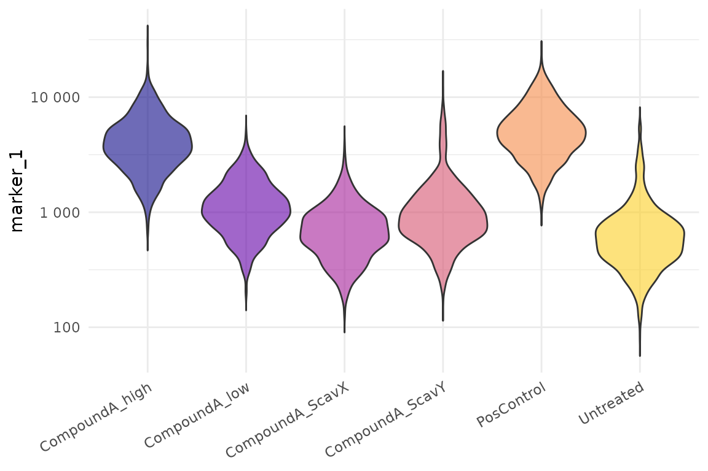
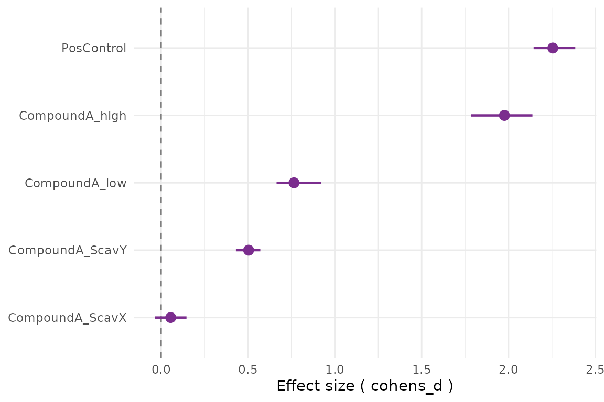
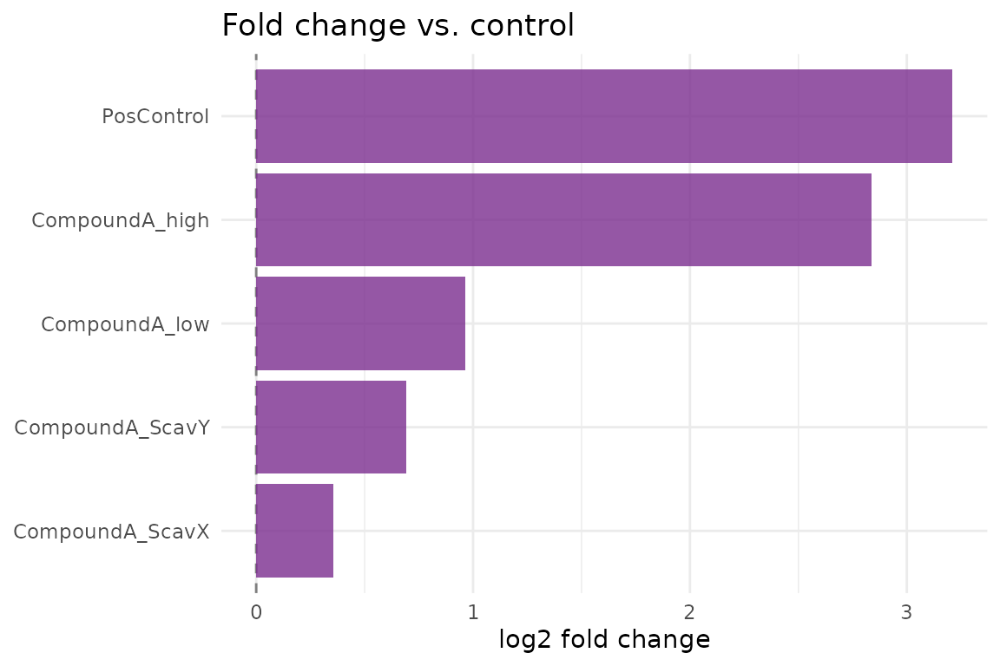
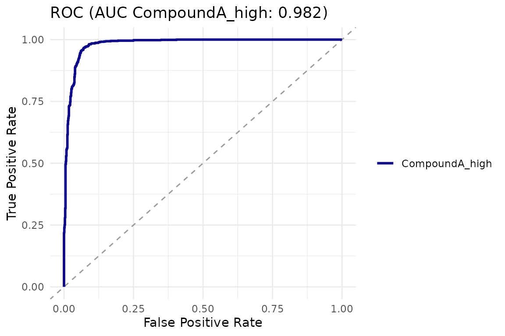

# Getting Started with cellreportR

cellreportR takes you from segmented single-cell microscopy data to a
structured, publication-ready diagnostic report. This vignette walks
through a full five-minute workflow using bundled synthetic data.

### 1. Load example data

The function
[`cr_example_experiment()`](https://cttir.github.io/cellreportR/reference/cr_example_experiment.md)
generates a realistic 96-well synthetic experiment with six treatment
groups, four channels, and plate-edge / debris / contamination artefacts
to exercise the QC pipeline.

``` r

exp <- cr_example_experiment(seed = 42, n_cells_per_well = 60)
exp
#> ── cr_experiment ───────────────────────────────────────────────────────────────
#> • Cells: 5757 across 96 wells
#> • Channels: "DAPI", "marker_1", "marker_2", and "marker_3"
#> • Design: 6 treatment groups
#> • QC steps applied: 0
#> ℹ Metadata fields: project and sop
```

### 2. Inspect the design

``` r

head(exp$design)
#> # A tibble: 6 × 7
#>   well  treatment  dose dose_unit group   replicate timepoint
#>   <chr> <chr>     <dbl> <chr>     <chr>       <int>     <dbl>
#> 1 A01   Untreated     0 uM        control         1        24
#> 2 B01   Untreated     0 uM        control         1        24
#> 3 C01   Untreated     0 uM        control         1        24
#> 4 D01   Untreated     0 uM        control         1        24
#> 5 E01   Untreated     0 uM        control         2        24
#> 6 F01   Untreated     0 uM        control         2        24
summary(exp)
#> # A tibble: 6 × 3
#>   treatment       n_wells n_cells
#>   <chr>             <int>   <int>
#> 1 CompoundA_ScavX      16     946
#> 2 CompoundA_ScavY      16     970
#> 3 CompoundA_high       16     962
#> 4 CompoundA_low        16     984
#> 5 PosControl           16     924
#> 6 Untreated            16     971
```

### 3. Apply quality control

``` r

exp_qc <- exp |>
  cr_qc_filter(min_area = 50, max_area = 5000, min_circularity = 0.2) |>
  cr_qc_doublets(k = 2.5)
cr_qc_summary(exp_qc)
#> # A tibble: 2 × 7
#>   step         parameters cells_before cells_after cells_removed percent_removed
#>   <chr>        <chr>             <int>       <int>         <int>           <dbl>
#> 1 cr_qc_filter min_area=…         5757        5442           315          5.47  
#> 2 cr_qc_doubl… method=ar…         5442        5440             2          0.0368
#> # ℹ 1 more variable: timestamp <dttm>
```

### 4. Compute fold changes and run tests

``` r

res <- cr_test_all(exp_qc,
                   channel = "marker_1",
                   control_group = "Untreated",
                   level = "replicate")
attr(res, "summary")
#> # A tibble: 5 × 6
#>   treatment       log2_fc    p_value cohens_d      p_adj interpretation
#>   <chr>             <dbl>      <dbl>    <dbl>      <dbl> <chr>         
#> 1 PosControl        3.21  0.00000154   2.26   0.00000386 strong        
#> 2 CompoundA_low     0.963 0.0000368    0.765  0.0000613  moderate      
#> 3 CompoundA_high    2.84  0.00000154   1.98   0.00000386 strong        
#> 4 CompoundA_ScavX   0.354 0.0302       0.0554 0.0302     weak          
#> 5 CompoundA_ScavY   0.690 0.0000509    0.504  0.0000636  moderate
```

### 5. Visualize

``` r

cr_plot_intensity(exp_qc, "marker_1")
```



``` r

cr_plot_effect_sizes(res)
```



``` r

cr_plot_foldchange(res)
```



### 6. Logistic regression and ROC

``` r

logit <- cr_logistic(exp_qc,
                     channel = "marker_1",
                     treatment = "CompoundA_high",
                     control = "Untreated")
cr_plot_roc(logit)
```



### 7. Next steps

- See
  [`vignette("statistical-analysis")`](https://cttir.github.io/cellreportR/articles/statistical-analysis.md)
  for details on the choice between cell-level and replicate-level
  tests.
- See
  [`vignette("dose-response")`](https://cttir.github.io/cellreportR/articles/dose-response.md)
  for IC50/EC50 fitting.
- Run
  [`cr_run_app()`](https://cttir.github.io/cellreportR/reference/cr_run_app.md)
  to explore your data interactively.

## Use of LLM tools

Portions of this package were prepared with assistance from large
language model tooling for narrowly defined, non-authorial tasks:
copyediting, prose smoothing, Markdown/LaTeX formatting, scaffolding of
boilerplate files (CI configs, build scripts), code refactoring. The
tools used were [Chat
AI](https://kisski.gwdg.de/leistungen/2-02-llm-service/), the LLM
service of KISSKI (GWDG), and a self-hosted **Mistral Small (24B,
Apache-2.0)** run locally via [Ollama](https://ollama.com/) and the
`ollamar` R package — local inference only, with no data sent to third
parties for the self-hosted model.

All scientific claims, methodological choices, analyses,
interpretations, and conclusions are the author’s own. No LLM-generated
text was incorporated without review and revision, and every reference
was verified against its DOI, arXiv ID, or ISBN.
