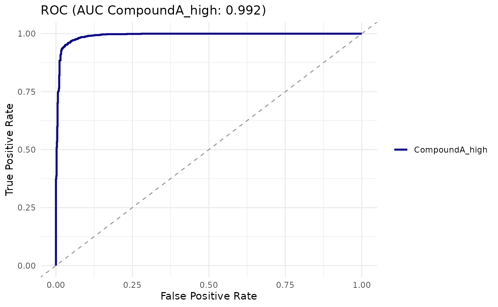

# Statistical Analysis of Cell-Based Assays

## Why hierarchical testing matters

In a microscopy-based cell assay, each treatment condition is measured
across several wells, and each well contains many individual cells.
Cells are not independent: their fluorescence is correlated within a
well (shared staining, focus, exposure). Treating every cell as an
independent replicate inflates sample size and gives optimistic
p-values.

cellreportR supports two standard resolutions:

- **Cell-level** tests treat each cell as a data point. Use these for
  distributional comparisons (e.g. is there a subpopulation shift).
- **Replicate-level** tests aggregate cells to one number per well, then
  test wells. Use these for the primary inference about whether a
  compound has an effect.

A defensible workflow is to run both and report effect size with CI
alongside p-values at the replicate level.

## A worked example

``` r

exp <- cr_example_experiment(seed = 2, n_cells_per_well = 60)
res <- cr_test(exp, "marker_1", "CompoundA_high", "Untreated",
               test = "mann_whitney", level = "both")
res$cell_level
#> # A tibble: 1 × 8
#>   level test         statistic p_value   n_x   n_y median_x median_y
#>   <chr> <chr>            <dbl>   <dbl> <int> <int>    <dbl>    <dbl>
#> 1 cell  mann_whitney    904417       0   969   941    4143.     553.
res$rep_level
#> # A tibble: 1 × 8
#>   level     test         statistic    p_value   n_x   n_y median_x median_y
#>   <chr>     <chr>            <dbl>      <dbl> <int> <int>    <dbl>    <dbl>
#> 1 replicate mann_whitney       256 0.00000154    16    16    4175.     550.
res$effect_sizes
#> # A tibble: 4 × 5
#>   method        estimate ci_low ci_high magnitude
#>   <chr>            <dbl>  <dbl>   <dbl> <chr>    
#> 1 cohens_d         2.22   2.12    2.35  large    
#> 2 hedges_g         2.22   2.13    2.34  large    
#> 3 cliffs_delta     0.984  0.977   0.989 large    
#> 4 rank_biserial   -0.984 -0.990  -0.978 large
```

Notice that the cell-level p-value is much smaller than the
replicate-level p-value — a consequence of the inflated sample size.

## Effect size interpretation

cellreportR computes Cohen’s d, Hedges’ g, Cliff’s delta and
rank-biserial correlation. Conventional benchmarks:

- \|d\| \< 0.2 — negligible
- 0.2 ≤ \|d\| \< 0.5 — small
- 0.5 ≤ \|d\| \< 0.8 — medium
- \|d\| ≥ 0.8 — large

Cliff’s delta benchmarks are 0.147 / 0.33 / 0.474.

``` r

set.seed(1)
cr_effect_size(rnorm(100, 1), rnorm(100, 0))
#> # A tibble: 4 × 5
#>   method        estimate ci_low ci_high magnitude
#>   <chr>            <dbl>  <dbl>   <dbl> <chr>    
#> 1 cohens_d         1.23   0.959   1.62  large    
#> 2 hedges_g         1.23   0.892   1.61  large    
#> 3 cliffs_delta     0.616  0.474   0.731 large    
#> 4 rank_biserial   -0.616 -0.730  -0.490 large
```

## ROC / AUC for discriminability

When the question is “does this marker discriminate treated from control
cells?”, fit a univariate logistic regression:

``` r

logit <- cr_logistic(exp, "marker_1", "CompoundA_high", "Untreated")
cr_auc(logit)
#> # A tibble: 1 × 4
#>     auc ci_low ci_high method
#>   <dbl>  <dbl>   <dbl> <chr> 
#> 1 0.992  0.989   0.995 delong
cr_plot_roc(logit)
```



## Multiple testing correction

[`cr_test_all()`](https://r-heller.github.io/cellreportR/reference/cr_test_all.md)
applies [`stats::p.adjust()`](https://rdrr.io/r/stats/p.adjust.html) by
default with the Benjamini-Hochberg method:

``` r

all_res <- cr_test_all(exp, "marker_1", "Untreated",
                       level = "replicate")
attr(all_res, "summary")
#> # A tibble: 5 × 6
#>   treatment       log2_fc    p_value cohens_d      p_adj interpretation
#>   <chr>             <dbl>      <dbl>    <dbl>      <dbl> <chr>         
#> 1 PosControl        3.10  0.00000154    2.23  0.00000386 strong        
#> 2 CompoundA_low     0.916 0.0000312     0.831 0.0000520  strong        
#> 3 CompoundA_high    2.92  0.00000154    2.22  0.00000386 strong        
#> 4 CompoundA_ScavX   0.314 0.109         0.135 0.109      no evidence   
#> 5 CompoundA_ScavY   0.578 0.0000433     0.538 0.0000541  moderate
```

## Power considerations

A quick hierarchical-aware power check:

``` r

cr_power_analysis(effect_size = 0.8,
                  n_replicates = 4,
                  n_cells_per_rep = 100,
                  n_sim = 200)
#> # A tibble: 1 × 5
#>   effect_size n_replicates n_cells_per_rep alpha power
#>         <dbl>        <dbl>           <dbl> <dbl> <dbl>
#> 1         0.8            4             100  0.05     1
```
