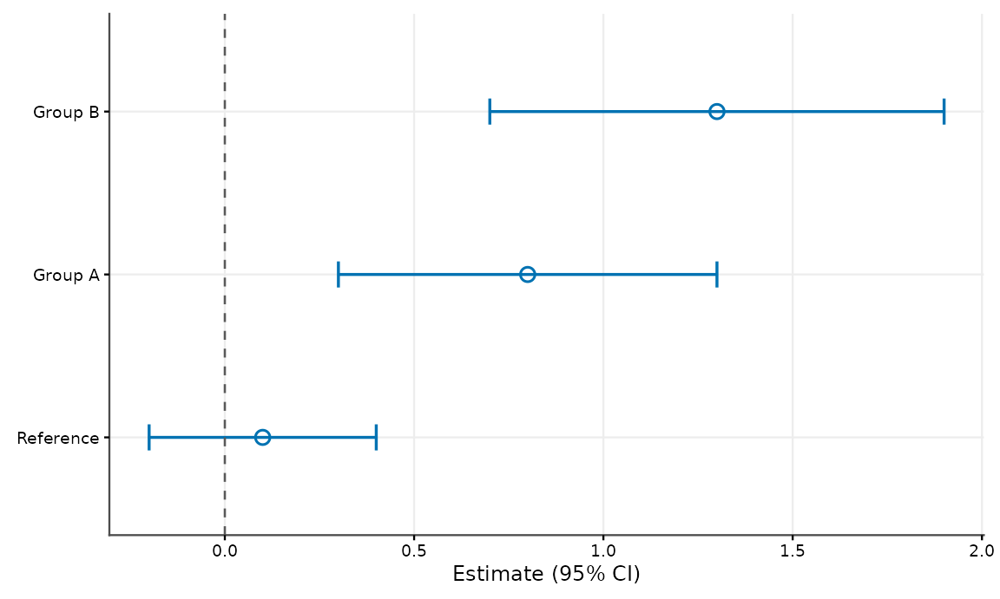
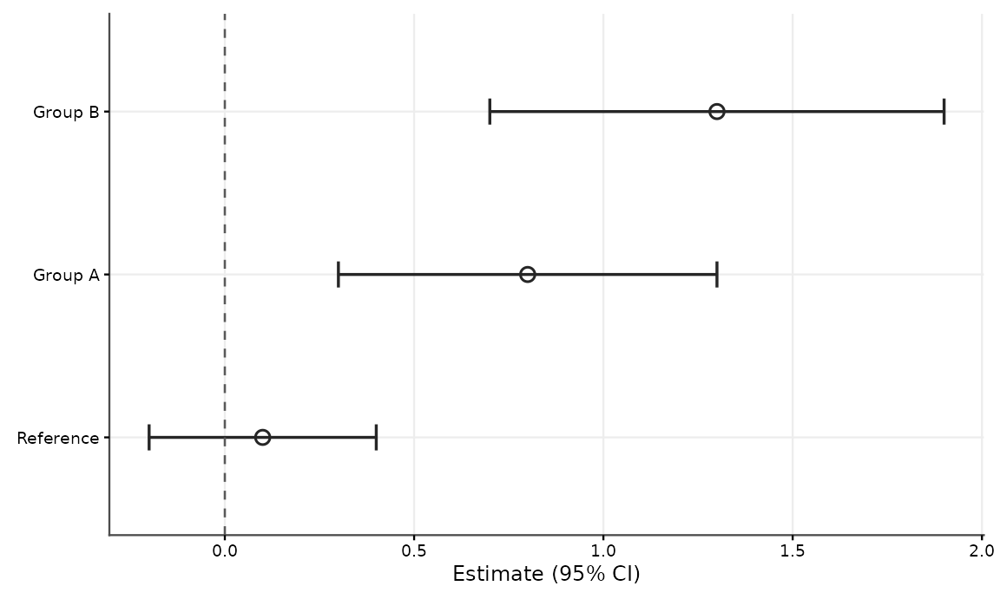
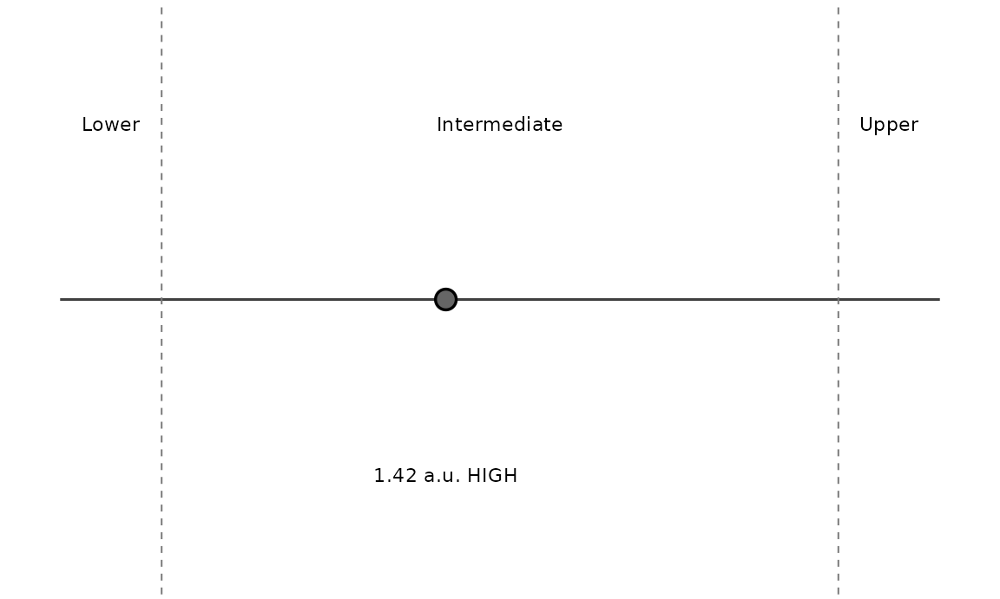
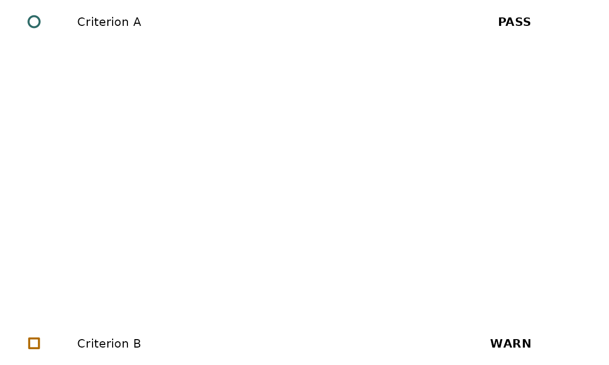

# Publication-ready figures with cellreportR

cellreportR uses position first, then shape or line type, then colour.
Colour is intentionally redundant for categorical distinctions. The
restrained default palette is designed with common colour-vision
deficiencies in mind, without a claim of formal accessibility
certification.

``` r

cellreportR::cr_palette()
```

    ##           blue     vermillion   bluish_green         orange reddish_purple 
    ##      "#0072B2"      "#D55E00"      "#009E73"      "#E69F00"      "#CC79A7" 
    ##       sky_blue         yellow           grey 
    ##      "#56B4E9"      "#F0E442"      "#999999"

``` r

cellreportR::cr_shapes(4)
```

    ## [1] 21 22 23 24

``` r

cellreportR::cr_linetypes(4)
```

    ## [1] "solid"   "dashed"  "dotdash" "dotted"

``` r

cellreportR::cr_plot_style("grayscale")
```

    ## $mode
    ## [1] "grayscale"
    ## 
    ## $variant
    ## [1] "publication"
    ## 
    ## $base_size
    ## [1] 9
    ## 
    ## $base_family
    ## [1] "sans"
    ## 
    ## $palette
    ## [1] "#262626" "#5A5A5A" "#777777" "#8D8D8D" "#A0A0A0" "#B0B0B0" "#BFBFBF"
    ## [8] "#CCCCCC"
    ## 
    ## $shapes
    ##  [1] 21 22 23 24 25  1  0  5  2  6
    ## 
    ## $linetypes
    ## [1] "solid"    "dashed"   "dotdash"  "dotted"   "longdash" "twodash" 
    ## 
    ## $legend_position
    ## [1] "bottom"
    ## 
    ## attr(,"class")
    ## [1] "cr_plot_style"

``` r

d <- data.frame(group=factor(c("Reference","Group A","Group B"),levels=c("Reference","Group A","Group B")),estimate=c(0.1,0.8,1.3),conf_low=c(-0.2,0.3,0.7),conf_high=c(0.4,1.3,1.9))
cellreportR::cr_plot_estimates(d,reference=0,colour_mode="colour")
```



``` r

cellreportR::cr_plot_estimates(d,reference=0,colour_mode="grayscale")
```



``` r

cellreportR::cr_plot_result_position(1.42,c(1,2),c("Lower","Intermediate","Upper"),unit="a.u.",classification="HIGH",mode="grayscale")
```



``` r

qc <- cellreportR::cr_report_qc(c("Criterion A","Criterion B"),c("met","review"),c("Configured criteria","Configured criteria"),c("PASS","WARN"))
cellreportR::cr_plot_qc_summary(qc)
```



Exports have explicit dimensions and a white background, independent of
an interactive plotting pane.

``` r

cellreportR::cr_save_figure(p,"figure.pdf",size="single")
cellreportR::cr_save_figure(p,"figure-wide.pdf",size="double")
cellreportR::cr_save_figure(p,"figure.tiff",size="double",dpi=600)
```

The style layer does not filter, transform, reorder analytically
meaningful values, or select results. Factor levels are respected;
explicit ordering is available in estimate plots. More than the reliable
number of colours, shapes, or line types produces a warning so callers
can prefer facets or direct labels.
